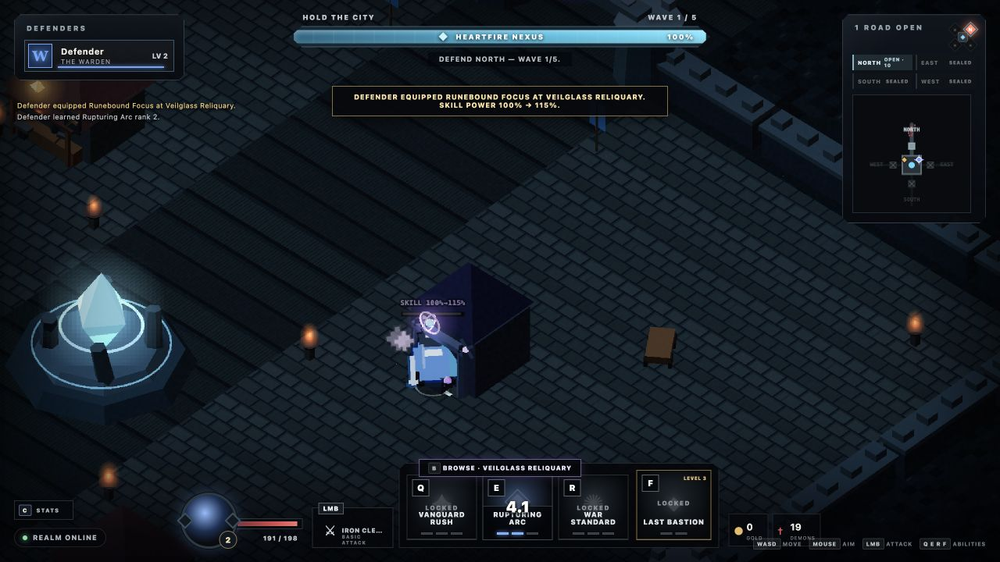

# X Hero Siege — playable vertical slice

A browser-first, 1–4 player co-op action RPG about defending humanity's last city from a demon invasion. Four distinct heroes protect the central Heartfire Nexus, survive a breach, then counterattack through the rift.

Version `0.1.18` is deliberately small: one 5–10 minute run that proves readable combat, party-sized lane defense, direct action-bar progression, truthful cooperative gold whose purchasing power and local destinations are readable from combat, two physical shops with distinct run-only wares, a readable and visibly resonant six-slot build with one meaningful duplicate threshold, knowable ordinary purchases whose accepted power lands on the hero, exact full-build reshaping, one pressure spike, and one boss payoff.



## Run locally

Requires [Bun](https://bun.sh/).

```sh
bun install
bun run dev
```

Open [http://localhost:3000](http://localhost:3000). Up to four browser clients can join the same local run.

## Controls

- `WASD`: move
- Mouse: aim
- Hold left mouse: primary attack
- `Q`, `E`, `R`: active abilities
- `F`: ultimate
- `C`: toggle the non-pausing Hero Stats panel
- `B`: browse or close a physical shop while in range
- `1` / `2`: buy and auto-equip the matching visible shop item; at `6/6`, select the incoming ware
- `1`–`6`: while reshaping a full build, select the occupied socket to replace
- `Enter`: confirm a selected replacement; `Escape` backs out without spending
- Click the gold `+` on a skill slot, or press `Ctrl` + `Q`/`E`/`R`/`F`, to spend a skill point

Level-ups grant skill points only while purchasable ranks remain. Upgrades happen directly on the action bar; the ultimate becomes available at hero level 3, and a fully maxed build stops receiving unusable points.

The northwest Ironbound Forge sells Basic Damage and Move Speed; the northeast Veilglass Reliquary sells Skill Power and Cooldown Speed. Every inexhaustible ware and full-build replacement costs 30 personal gold, auto-equips into the first of six unrestricted run-only slots, allows duplicates, and immediately updates the authoritative Hero Stats panel after server acceptance. When the local authoritative wallet can fund current stock, the gold tile says `WARE READY` or `REFORGE READY` at `6/6`, and both affordable physical shop shapes receive equal restrained minimap outlines. This identifies purchasing power and destinations without claiming a safe window, choosing a route, opening a remote catalog, or relaxing proximity-only `B`. Hero Stats groups duplicates into named stacks, while every ordinary local shop card discloses the current owned count and exact next champion-specific Hero Stat result—even when the ware is unaffordable. The live Hero Stats panel remains the current accepted state until the purchase succeeds; then one short item-colored, item-shaped receipt lands on the hero and repeats the exact incoming stat change in the world and toast. Reconnects and snapshot history never manufacture that transient. A fourth matching ware **Attunes** its stack: that fourth copy contributes twice its ordinary listed effect once, while the fifth and sixth resume normal increments. This makes `3/3` breadth and `4/2` specialization meaningfully different without typed slots or a second progression system. Crossing `×3 → ×4` ignites the larger server-authored, ware-colored awakening around the hero and settles into a faint second echo of the same signature; a `×4 → ×3` reforge releases it quietly, while fifth copies, reconnects, and repeated snapshots never replay the ceremony. On the battlefield, every equipped hero wears the color-and-shape signature of the ware with the most socket investment, and a tie below four follows the first occupied socket. The first safe retreat earns one defining ware; completing all six sockets requires sustained defense, and reshaping a full build requires a fresh earning window. At `6/6`, ordinary previews yield to the exact slot-specific reforge flow: select one local ware and one occupied socket. Before the irreversible full-price trade, the confirmation shows the exact outgoing and incoming effects, stack and Attunement changes, affected Hero Stats, and resulting battlefield signature. The old item is discarded without a refund and the build remains `6/6`; replacing an item with itself is rejected. North defenders choose left or right at equal travel cost, while East and West naturally favor different vendors; there is no global shop menu or inventory screen.

## Verification

```sh
bun run check
bun test
```

Runtime diagnostics are available at `/health` and `/debug/state`.

## Project notes

- [Approved game direction](docs/GAME_DIRECTION.md)
- [Slice-first roadmap](docs/ROADMAP.md)
- [Playtest script](docs/PLAYTEST.md)
- [Changelog](CHANGELOG.md)
- [Human-readable devlog](docs/DEVLOG.md)
- [Live companion website](https://fabiengreard.github.io/x-hero-siege/) and [source](site/index.html)
