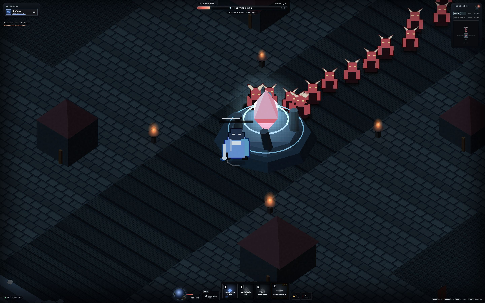

# X Hero Siege — playable vertical slice

A browser-first, 1–4 player co-op action RPG about defending humanity's last city from a demon invasion. Four distinct heroes protect the central Heartfire Nexus, survive a breach, then counterattack through the rift.

Version `0.1.3` is deliberately small: one 5–10 minute run that proves readable movement and attacks, party-sized lane defense, direct action-bar progression, one pressure spike, and one boss payoff.



## Run locally

Requires [Bun](https://bun.sh/).

```sh
bun install
bun run dev
```

Open [http://localhost:3000](http://localhost:3000). Up to four browser clients can join the same local run.

## Controls

- `WASD`: move
- Mouse: aim
- Hold left mouse: primary attack
- `Q`, `E`, `R`: active abilities
- `F`: ultimate
- Click the gold `+` on a skill slot, or press `Ctrl` + `Q`/`E`/`R`/`F`, to spend a skill point

Level-ups grant skill points only while purchasable ranks remain. Upgrades happen directly on the action bar; the ultimate becomes available at hero level 3, and a fully maxed build stops receiving unusable points.

## Verification

```sh
bun run check
bun test
```

Runtime diagnostics are available at `/health` and `/debug/state`.

## Project notes

- [Approved game direction](docs/GAME_DIRECTION.md)
- [Slice-first roadmap](docs/ROADMAP.md)
- [Playtest script](docs/PLAYTEST.md)
- [Changelog](CHANGELOG.md)
