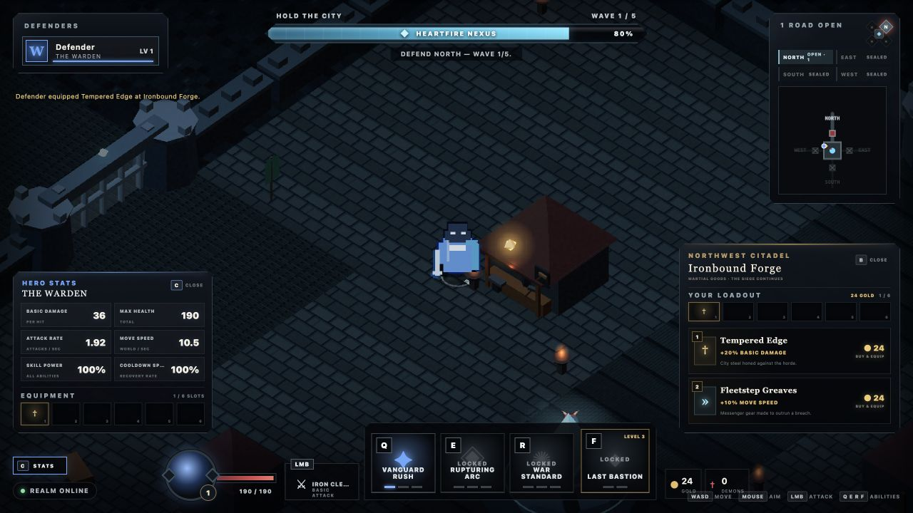

# X Hero Siege — playable vertical slice

A browser-first, 1–4 player co-op action RPG about defending humanity's last city from a demon invasion. Four distinct heroes protect the central Heartfire Nexus, survive a breach, then counterattack through the rift.

Version `0.1.7` is deliberately small: one 5–10 minute run that proves readable combat, party-sized lane defense, direct action-bar progression, truthful cooperative gold, one physical Forge with two run-only wares and six unrestricted equipment slots, one pressure spike, and one boss payoff.



## Run locally

Requires [Bun](https://bun.sh/).

```sh
bun install
bun run dev
```

Open [http://localhost:3000](http://localhost:3000). Up to four browser clients can join the same local run.

## Controls

- `WASD`: move
- Mouse: aim
- Hold left mouse: primary attack
- `Q`, `E`, `R`: active abilities
- `F`: ultimate
- `C`: toggle the non-pausing Hero Stats panel
- `B`: browse or close a physical shop while in range
- `1` / `2`: buy and auto-equip the matching visible shop item
- Click the gold `+` on a skill slot, or press `Ctrl` + `Q`/`E`/`R`/`F`, to spend a skill point

Level-ups grant skill points only while purchasable ranks remain. Upgrades happen directly on the action bar; the ultimate becomes available at hero level 3, and a fully maxed build stops receiving unusable points.

The Ironbound Forge sits in the northwest Citadel courtyard. Its two inexhaustible wares cost 24 personal gold, auto-equip into the first of six unrestricted run-only slots, allow duplicates, and immediately update the authoritative Hero Stats panel.

## Verification

```sh
bun run check
bun test
```

Runtime diagnostics are available at `/health` and `/debug/state`.

## Project notes

- [Approved game direction](docs/GAME_DIRECTION.md)
- [Slice-first roadmap](docs/ROADMAP.md)
- [Playtest script](docs/PLAYTEST.md)
- [Changelog](CHANGELOG.md)
- [Human-readable devlog](docs/DEVLOG.md)
- [Companion website](site/index.html)
