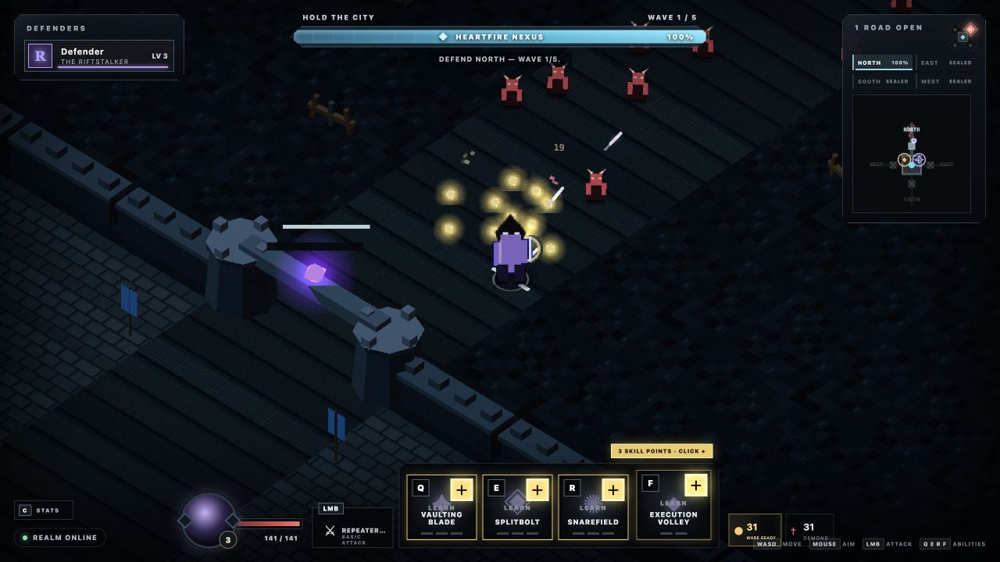

# X Hero Siege — playable vertical slice

A browser-first, 1–4 player co-op action RPG about defending humanity's last city from a demon invasion. Four distinct heroes protect the central Heartfire Nexus, survive a breach, then counterattack through the rift.

Version `0.1.28` is deliberately small: one 5–10 minute run that proves readable combat with trustworthy, identity-specific ranged primaries, party-sized lane defense with exact active-gate durability, direct action-bar progression, truthful cooperative gold whose purchasing power and local destinations are readable from combat, two physical shops with distinct run-only wares, champion-specific current consequences for every primary and learned ability, exact learned fresh-cast returns before Quickening purchases and reforges, a readable and visibly resonant six-slot build whose early duplicate commitment and meaningful threshold stay legible, one earned ware evolution that carries movement into a primary attack and leaves a restrained in-world step, knowable ordinary purchases whose accepted power lands on the hero, full-build reshaping in which every offered trade can actually change the build, bounded same-run reconnect recovery, one pressure spike, and one boss payoff.



Riftstalker and Ashcaller basics now resolve toward the latest server-accepted aim at release, stop at their declared `22` and `20` world-unit ranges, and sweep the path they actually travel. Repeater Shot penetrates the nearest two bodies; Ember Lance keeps its full direct hit and adds a three-unit half-damage contact burst. Their committed action now ends before the unchanged attack cooldown, creating a real full-speed repositioning gap without granting baseline movement during windup or impact. Thin champion-colored launch, travel, and contact forms replace the old generic ranged-basic aftermath while ability arrows, single-target and Rift Heart damage, cadence, controls, and Combat Stride remain established.

City Watch names every active gate's exact authoritative health percentage inside its existing compact tile, while a calm world-space bar carries the same durability read near the physical wall. Sealed approaches remain `SEALED`, breached walls become `FALLEN`, and raw health plus threat count stay available to assistive technology. The Heartfire Nexus remains the sole dominant top bar and the only structure whose destruction ends the run.

## Run locally

Requires [Bun](https://bun.sh/).

```sh
bun install
bun run dev
```

Open [http://localhost:3000](http://localhost:3000). Up to four browser clients can join the same local run.

## Controls

- `WASD`: move
- Mouse: aim
- Hold left mouse: primary attack
- `Q`, `E`, `R`: active abilities
- `F`: ultimate
- `C`: toggle the non-pausing Hero Stats panel
- `B`: browse or close a physical shop while in range
- `1` / `2`: buy and auto-equip the matching visible shop item; at `6/6`, select the incoming ware
- `1`–`6`: while reshaping a full build, select the occupied socket to replace
- `Enter`: confirm a selected replacement; `Escape` backs out without spending
- Click the gold `+` on a skill slot, or press `Ctrl` + `Q`/`E`/`R`/`F`, to spend a skill point

Level-ups grant skill points only while purchasable ranks remain. Upgrades happen directly on the action bar; the ultimate becomes available at hero level 3, and a fully maxed build stops receiving unusable points.

The northwest Ironbound Forge sells Basic Damage and Move Speed; the northeast Veilglass Reliquary sells Skill Power and Cooldown Speed. Every inexhaustible ware and full-build replacement costs 30 personal gold, auto-equips into the first of six unrestricted run-only slots, allows duplicates, and immediately updates the authoritative Hero Stats panel after server acceptance. When the local authoritative wallet can fund current stock, the gold tile says `WARE READY` or `REFORGE READY` at `6/6`, and both affordable physical shop shapes receive equal restrained minimap outlines. This identifies purchasing power and destinations without claiming a safe window, choosing a route, opening a remote catalog, or relaxing proximity-only `B`. Hero Stats now resolves aggregate Basic Damage and Attack Rate into each champion's named primary, exact current per-target damage, and cadence; Soul Scythe also names its real per-target healing. The same current-build surface resolves Skill Power and Cooldown Speed into every learned champion ability's exact current per-target magnitude and effective cooldown, while unlearned skills remain explicitly unlearned. Those values come from canonical definitions shared with authoritative resolution. Hero Stats also groups duplicates into named stacks, while every ordinary local shop card discloses the current owned count and exact next champion-specific Hero Stat result—even when the ware is unaffordable. Every owned stack shows `ATTUNEMENT 1/4` or `ATTUNEMENT 2/4` in Hero Stats and its local shop card before the established threshold state. The live panel remains the current accepted state until the purchase succeeds; then one short item-colored, item-shaped receipt lands on the hero and repeats the exact incoming stat change in the world and toast. Reconnects and snapshot history never manufacture that transient. A fourth matching ware **Attunes** its stack: that fourth copy contributes twice its ordinary listed effect once, while the fifth and sixth resume normal increments. This makes `3/3` breadth and `4/2` specialization meaningfully different without typed slots or a second progression system. Fleetstep Greaves now deepen that established commitment with the first earned ware evolution: at four copies, Combat Stride retains `15%` of the champion's current Move Speed during primary windup and impact. The Forge previews the exact current-champion `WORLD/S` rate, and the named `LMB` row keeps it visible; recovery, abilities, damage, cadence, and aim retain their established behavior. While that movement is active, Fleetstep's existing cyan lower chevrons leave one restrained step opposite the hero's actual velocity during moving primary windup and impact, settle home through recovery, and remain quieter on allies. The read adds no new particle, ring, audio, HUD, or gameplay system. Crossing `×3 → ×4` ignites the larger server-authored, ware-colored awakening around the hero and settles into a faint second echo of the same signature; a `×4 → ×3` reforge releases it quietly, while fifth copies, reconnects, and repeated snapshots never replay the ceremony. On the battlefield, every equipped hero wears the color-and-shape signature of the ware with the most socket investment, and a tie below four follows the first occupied socket. The first safe retreat earns one defining ware; completing all six sockets requires sustained defense, and reshaping a full build requires a fresh earning window. At `6/6`, ordinary previews yield to the exact slot-specific reforge flow: select one local ware and one occupied socket. A ware that already fills all six sockets becomes a disabled `FULL STACK` truth instead of opening an impossible all-disabled picker; mouse and number shortcuts announce the no-change result without sending or spending. Five matching copies plus one different ware still retain that one legal path to six, and every cross-ware target remains available. Before an irreversible full-price trade, the confirmation shows the exact outgoing and incoming effects, stack and Attunement changes, affected Hero Stats, and resulting battlefield signature. The old item is discarded without a refund and the build remains `6/6`. North defenders choose left or right at equal travel cost, while East and West naturally favor different vendors; there is no global shop menu or inventory screen.

Quickening Sigil keeps its aggregate Cooldown Speed projection, then translates it into exact current-to-projected fresh-cast cooldowns for every learned `Q`/`E`/`R`/`F` ability. Unlearned abilities stay omitted, and the final full-build reforge confirmation gives the same learned-cast answer whenever Quickening enters or leaves. These are read-only full-recharge projections: live remaining timers, preserved active-cooldown progress, LMB cadence, ability timing, item power, and server authority do not change.

If a connection drops, the live server holds that defender's exact run state for 15 seconds. A page reload or short network interruption restores the same identity, gold, equipment, stats, ranks, cooldowns, and host role while the siege keeps moving; held input is neutralized and the hero remains vulnerable. The token lives only in per-tab session storage and the reservation only in server memory—there are no accounts, permanent inventories, or join-in-progress semantics. Production HTML names a content-fingerprinted client bundle so an immutable cache cannot pair an old client protocol with a new server.

## Verification

```sh
bun run check
bun test
bun run smoke:production
bun run smoke:multiplayer
```

Runtime diagnostics are available at `/health` and `/debug/state`.

## Project notes

- [Approved game direction](docs/GAME_DIRECTION.md)
- [Slice-first roadmap](docs/ROADMAP.md)
- [Playtest script](docs/PLAYTEST.md)
- [Changelog](CHANGELOG.md)
- [Human-readable devlog](docs/DEVLOG.md)
- [Live companion website](https://fabiengreard.github.io/x-hero-siege/) and [source](site/index.html)
