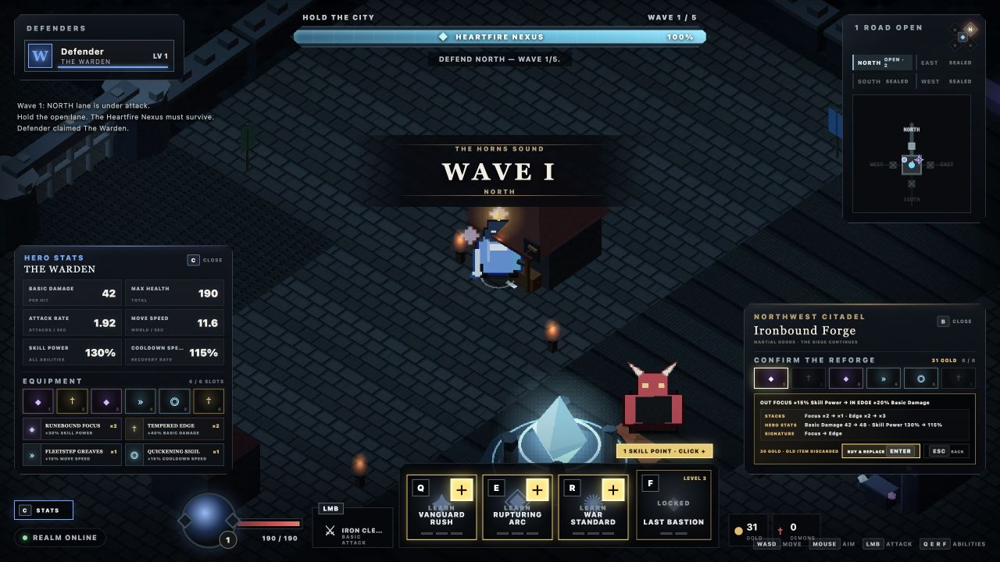

# X Hero Siege — playable vertical slice

A browser-first, 1–4 player co-op action RPG about defending humanity's last city from a demon invasion. Four distinct heroes protect the central Heartfire Nexus, survive a breach, then counterattack through the rift.

Version `0.1.13` is deliberately small: one 5–10 minute run that proves readable combat, party-sized lane defense, direct action-bar progression, truthful cooperative gold whose purchasing power carries weight, two physical shops with distinct run-only wares, a readable and visibly embodied six-slot build, exact full-build reshaping, one pressure spike, and one boss payoff.



## Run locally

Requires [Bun](https://bun.sh/).

```sh
bun install
bun run dev
```

Open [http://localhost:3000](http://localhost:3000). Up to four browser clients can join the same local run.

## Controls

- `WASD`: move
- Mouse: aim
- Hold left mouse: primary attack
- `Q`, `E`, `R`: active abilities
- `F`: ultimate
- `C`: toggle the non-pausing Hero Stats panel
- `B`: browse or close a physical shop while in range
- `1` / `2`: buy and auto-equip the matching visible shop item; at `6/6`, select the incoming ware
- `1`–`6`: while reshaping a full build, select the occupied socket to replace
- `Enter`: confirm a selected replacement; `Escape` backs out without spending
- Click the gold `+` on a skill slot, or press `Ctrl` + `Q`/`E`/`R`/`F`, to spend a skill point

Level-ups grant skill points only while purchasable ranks remain. Upgrades happen directly on the action bar; the ultimate becomes available at hero level 3, and a fully maxed build stops receiving unusable points.

The northwest Ironbound Forge sells Basic Damage and Move Speed; the northeast Veilglass Reliquary sells Skill Power and Cooldown Speed. Every inexhaustible ware and full-build replacement costs 30 personal gold, auto-equips into the first of six unrestricted run-only slots, allows duplicates, and immediately updates the authoritative Hero Stats panel. Hero Stats groups duplicates into named stacks with total effects, while each local shop card discloses the current owned count. On the battlefield, every equipped hero wears the color-and-shape signature of the ware with the most socket investment; a tie follows the first occupied socket. The first safe retreat earns one defining ware; completing all six sockets requires sustained defense, and reshaping a full build requires a fresh earning window. At `6/6`, select one local ware and one occupied socket. Before the irreversible full-price trade, the confirmation shows the exact outgoing and incoming effects, stack changes, affected Hero Stats, and resulting battlefield signature. The old item is discarded without a refund and the build remains `6/6`; replacing an item with itself is rejected. North defenders choose left or right at equal travel cost, while East and West naturally favor different vendors; there is no global shop menu or inventory screen.

## Verification

```sh
bun run check
bun test
```

Runtime diagnostics are available at `/health` and `/debug/state`.

## Project notes

- [Approved game direction](docs/GAME_DIRECTION.md)
- [Slice-first roadmap](docs/ROADMAP.md)
- [Playtest script](docs/PLAYTEST.md)
- [Changelog](CHANGELOG.md)
- [Human-readable devlog](docs/DEVLOG.md)
- [Live companion website](https://fabiengreard.github.io/x-hero-siege/) and [source](site/index.html)
